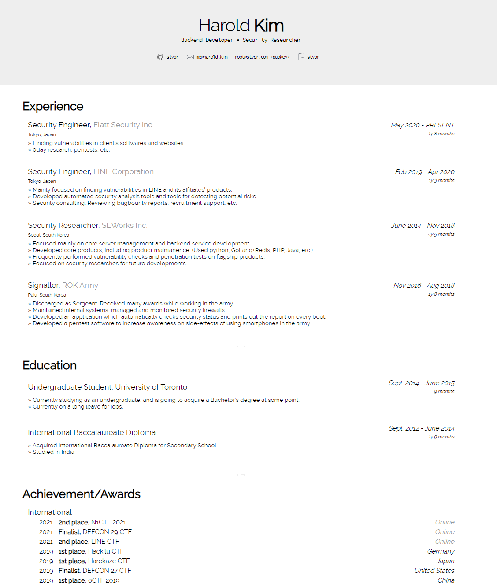

# resume-template

Designed and developed this page back in 2016, inspired by [AwesomeCV](https://github.com/posquit0/Awesome-CV).

You can use this template to make your own resume, but make sure to mention me and Awesome-CV at the bottom of the page.

## Example

* ~2020
  https://stypr.github.io/resume-template/resume/

